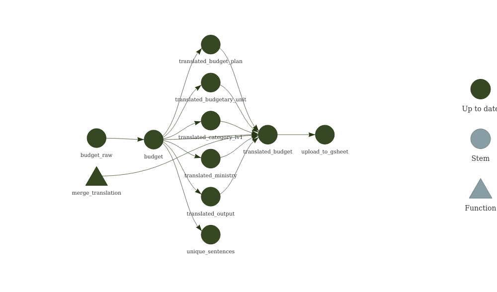

ThaiGov’s 2022 Budget
================

<blockquote class="twitter-tweet">
<p lang="th" dir="ltr">
\[ Excel
<a href="https://twitter.com/hashtag/%E0%B8%87%E0%B8%9A65?src=hash&amp;ref_src=twsrc%5Etfw">\#งบ65</a>
สำเร็จแล้ว! ใช้ไปเลยชั่วลูกชั่วหลาน \]<br><br>ดาวน์โหลด:
<a href="https://t.co/PuhflF8DEF">https://t.co/PuhflF8DEF</a><br><br>เราจะทำตามสัญญา
ขอเวลาอีกไม่นาน …<br><br>หลัง งปม. วาระ 1 ผ่านสภา
พวกเราเคยให้สัญญากับทุกท่านไว้ว่า จะรวมพลังสาย dev เพื่อแปลงงบ pdf สู่
machine-readable แบบทำครั้งเดียว ใช้ได้ชั่วลูกชั่วหลาน
<a href="https://t.co/b0pWMF3jDc">pic.twitter.com/b0pWMF3jDc</a>
</p>
— ณัฐพงษ์ เรืองปัญญาวุฒิ (เท้ง) (@teng\_mfp)
<a href="https://twitter.com/teng_mfp/status/1417872910383865859?ref_src=twsrc%5Etfw">July
21, 2021</a>
</blockquote>
<script async src="https://platform.twitter.com/widgets.js" charset="utf-8"></script>

``` r
options(tidyverse.quiet = TRUE)
tar_option_set(packages = c("dplyr", "ggplot2", "googlesheets4", "tidyr", "skimr", "magrittr", "googleLanguageR"))
merge_translation <- function(x, translation, column) {
  translation %>%
    merge(x, ., by.x = column, by.y = "text") %>%
    select(-detectedSourceLanguage) %>%
    rename_with( ~ gsub("translatedText", paste0(column, "_en"), .x, fixed = TRUE))
}
#> Established _targets.R and _targets_r/globals/unnamed-chunk-3.R.
```

# Targets

``` r
tar_target(budget_raw, {
  read_sheet("https://docs.google.com/spreadsheets/d/1yyWXSTbq3CD_gNxks-krcSBzbszv3c_2Nq54lckoQ24/edit#gid=1625073248")
})
#> Defined target budget_raw automatically from chunk code.
#> Established _targets.R and _targets_r/targets/budget_raw.R.
```

``` r
list(
  tar_target(budget, budget_raw %>% janitor::clean_names()),
  tar_target(unique_sentences, {
    budget %>%
      select(
        ministry,
        budgetary_unit,
        budget_plan,
        output,
        project,
        starts_with("category"),
        item_description
      ) %>% {
        as.character(unique(unlist(.)))
      }
  }),
  tar_target(sampled_sentences,
             sample(unique_sentences, 5))
)
#> Established _targets.R and _targets_r/targets/data-prep.R.
```

``` r
tar_target(chunks_of_unique_sentences, {
  unique_sentences %>%
    sample(size = 20, replace = FALSE) %>%
    split(., ceiling(seq_along(.) / 5))
})
#> Defined target chunks_of_unique_sentences automatically from chunk code.
#> Established _targets.R and _targets_r/targets/chunks_of_unique_sentences.R.
```

``` r
list(
  tar_target(translated_sentences, {
    gl_translate(sampled_sentences, target = "en")
  }),
  tar_target(translated_ministry, {
    budget$ministry %>%
      unique() %>%
      gl_translate(target = "en")
  }),
  tar_target(translated_budgetary_unit, {
    budget$budgetary_unit %>%
      unique() %>%
      gl_translate(target = "en")
  }),
  tar_target(translated_budget_plan, {
    budget$budget_plan %>%
      unique() %>%
      gl_translate(target = "en")
  }),
  tar_target(translated_output, {
    budget$output %>%
      unique() %>%
      gl_translate(target = "en")
  })
)
#> Established _targets.R and _targets_r/targets/translation.R.
```

``` r
list(
  tar_target(
    translated_chucks, 
    gl_translate(chunks_of_unique_sentences[[1]], target = "en"), 
    pattern = map(chunks_of_unique_sentences), 
    iteration = "list"
  )
)
#> Established _targets.R and _targets_r/targets/translate-by-chunk.R.
```

``` r
tar_target(translated_budget, {
  budget %>%
    merge_translation(translated_ministry, "ministry") %>%
    merge_translation(translated_budgetary_unit, "budgetary_unit") %>%
    merge_translation(translated_budget_plan, "budget_plan") %>%
    merge_translation(translated_output, "output")
})
#> Defined target translated_budget automatically from chunk code.
#> Established _targets.R and _targets_r/targets/translated_budget.R.
```

# Pipeline

``` r
tar_make()
#> ✓ skip target budget_raw
#> ✓ skip target budget
#> ✓ skip target translated_output
#> ✓ skip target translated_budget_plan
#> ✓ skip target unique_sentences
#> ✓ skip target translated_ministry
#> ✓ skip target translated_budgetary_unit
#> ✓ skip target sampled_sentences
#> ✓ skip target chunks_of_unique_sentences
#> ✓ skip target translated_budget
#> ✓ skip target translated_sentences
#> ✓ skip branch translated_chucks_33eba18a
#> ✓ skip branch translated_chucks_a004f113
#> ✓ skip branch translated_chucks_814ee942
#> ✓ skip branch translated_chucks_ff41d1d6
#> ✓ skip pattern translated_chucks
#> ✓ skip pipeline
```

``` r
tar_visnetwork()
```

<!-- -->

# Output

``` r
library(dplyr)
library(skimr)
library(ggplot2)
library(kableExtra)
library(stringr)
library(forcats)
library(scales)
```

``` r
tar_read(budget) %>%
  skimr::skim()
```

<table style="width: auto;" class="table table-condensed">
<caption>
Data summary
</caption>
<thead>
<tr>
<th style="text-align:left;">
</th>
<th style="text-align:left;">
</th>
</tr>
</thead>
<tbody>
<tr>
<td style="text-align:left;">
Name
</td>
<td style="text-align:left;">
Piped data
</td>
</tr>
<tr>
<td style="text-align:left;">
Number of rows
</td>
<td style="text-align:left;">
51767
</td>
</tr>
<tr>
<td style="text-align:left;">
Number of columns
</td>
<td style="text-align:left;">
20
</td>
</tr>
<tr>
<td style="text-align:left;">
\_\_\_\_\_\_\_\_\_\_\_\_\_\_\_\_\_\_\_\_\_\_\_
</td>
<td style="text-align:left;">
</td>
</tr>
<tr>
<td style="text-align:left;">
Column type frequency:
</td>
<td style="text-align:left;">
</td>
</tr>
<tr>
<td style="text-align:left;">
character
</td>
<td style="text-align:left;">
13
</td>
</tr>
<tr>
<td style="text-align:left;">
logical
</td>
<td style="text-align:left;">
4
</td>
</tr>
<tr>
<td style="text-align:left;">
numeric
</td>
<td style="text-align:left;">
3
</td>
</tr>
<tr>
<td style="text-align:left;">
\_\_\_\_\_\_\_\_\_\_\_\_\_\_\_\_\_\_\_\_\_\_\_\_
</td>
<td style="text-align:left;">
</td>
</tr>
<tr>
<td style="text-align:left;">
Group variables
</td>
<td style="text-align:left;">
None
</td>
</tr>
</tbody>
</table>

**Variable type: character**

<table>
<thead>
<tr>
<th style="text-align:left;">
skim\_variable
</th>
<th style="text-align:right;">
n\_missing
</th>
<th style="text-align:right;">
complete\_rate
</th>
<th style="text-align:right;">
min
</th>
<th style="text-align:right;">
max
</th>
<th style="text-align:right;">
empty
</th>
<th style="text-align:right;">
n\_unique
</th>
<th style="text-align:right;">
whitespace
</th>
</tr>
</thead>
<tbody>
<tr>
<td style="text-align:left;">
item\_id
</td>
<td style="text-align:right;">
0
</td>
<td style="text-align:right;">
1.00
</td>
<td style="text-align:right;">
10
</td>
<td style="text-align:right;">
17
</td>
<td style="text-align:right;">
0
</td>
<td style="text-align:right;">
51767
</td>
<td style="text-align:right;">
0
</td>
</tr>
<tr>
<td style="text-align:left;">
ref\_doc
</td>
<td style="text-align:right;">
0
</td>
<td style="text-align:right;">
1.00
</td>
<td style="text-align:right;">
8
</td>
<td style="text-align:right;">
12
</td>
<td style="text-align:right;">
0
</td>
<td style="text-align:right;">
24
</td>
<td style="text-align:right;">
0
</td>
</tr>
<tr>
<td style="text-align:left;">
ministry
</td>
<td style="text-align:right;">
0
</td>
<td style="text-align:right;">
1.00
</td>
<td style="text-align:right;">
6
</td>
<td style="text-align:right;">
99
</td>
<td style="text-align:right;">
0
</td>
<td style="text-align:right;">
36
</td>
<td style="text-align:right;">
0
</td>
</tr>
<tr>
<td style="text-align:left;">
budgetary\_unit
</td>
<td style="text-align:right;">
0
</td>
<td style="text-align:right;">
1.00
</td>
<td style="text-align:right;">
6
</td>
<td style="text-align:right;">
79
</td>
<td style="text-align:right;">
0
</td>
<td style="text-align:right;">
718
</td>
<td style="text-align:right;">
0
</td>
</tr>
<tr>
<td style="text-align:left;">
budget\_plan
</td>
<td style="text-align:right;">
0
</td>
<td style="text-align:right;">
1.00
</td>
<td style="text-align:right;">
19
</td>
<td style="text-align:right;">
754
</td>
<td style="text-align:right;">
0
</td>
<td style="text-align:right;">
99
</td>
<td style="text-align:right;">
0
</td>
</tr>
<tr>
<td style="text-align:left;">
output
</td>
<td style="text-align:right;">
26898
</td>
<td style="text-align:right;">
0.48
</td>
<td style="text-align:right;">
11
</td>
<td style="text-align:right;">
196
</td>
<td style="text-align:right;">
0
</td>
<td style="text-align:right;">
371
</td>
<td style="text-align:right;">
0
</td>
</tr>
<tr>
<td style="text-align:left;">
project
</td>
<td style="text-align:right;">
27073
</td>
<td style="text-align:right;">
0.48
</td>
<td style="text-align:right;">
19
</td>
<td style="text-align:right;">
230
</td>
<td style="text-align:right;">
0
</td>
<td style="text-align:right;">
1351
</td>
<td style="text-align:right;">
0
</td>
</tr>
<tr>
<td style="text-align:left;">
category\_lv1
</td>
<td style="text-align:right;">
3
</td>
<td style="text-align:right;">
1.00
</td>
<td style="text-align:right;">
2
</td>
<td style="text-align:right;">
72
</td>
<td style="text-align:right;">
0
</td>
<td style="text-align:right;">
31
</td>
<td style="text-align:right;">
0
</td>
</tr>
<tr>
<td style="text-align:left;">
category\_lv2
</td>
<td style="text-align:right;">
122
</td>
<td style="text-align:right;">
1.00
</td>
<td style="text-align:right;">
7
</td>
<td style="text-align:right;">
354
</td>
<td style="text-align:right;">
0
</td>
<td style="text-align:right;">
1777
</td>
<td style="text-align:right;">
0
</td>
</tr>
<tr>
<td style="text-align:left;">
category\_lv3
</td>
<td style="text-align:right;">
13654
</td>
<td style="text-align:right;">
0.74
</td>
<td style="text-align:right;">
7
</td>
<td style="text-align:right;">
348
</td>
<td style="text-align:right;">
0
</td>
<td style="text-align:right;">
1395
</td>
<td style="text-align:right;">
0
</td>
</tr>
<tr>
<td style="text-align:left;">
category\_lv4
</td>
<td style="text-align:right;">
29904
</td>
<td style="text-align:right;">
0.42
</td>
<td style="text-align:right;">
8
</td>
<td style="text-align:right;">
118
</td>
<td style="text-align:right;">
0
</td>
<td style="text-align:right;">
217
</td>
<td style="text-align:right;">
0
</td>
</tr>
<tr>
<td style="text-align:left;">
item\_description
</td>
<td style="text-align:right;">
5429
</td>
<td style="text-align:right;">
0.90
</td>
<td style="text-align:right;">
8
</td>
<td style="text-align:right;">
466
</td>
<td style="text-align:right;">
0
</td>
<td style="text-align:right;">
19806
</td>
<td style="text-align:right;">
0
</td>
</tr>
<tr>
<td style="text-align:left;">
debug\_log
</td>
<td style="text-align:right;">
50733
</td>
<td style="text-align:right;">
0.02
</td>
<td style="text-align:right;">
167
</td>
<td style="text-align:right;">
847
</td>
<td style="text-align:right;">
0
</td>
<td style="text-align:right;">
767
</td>
<td style="text-align:right;">
0
</td>
</tr>
</tbody>
</table>

**Variable type: logical**

<table>
<thead>
<tr>
<th style="text-align:left;">
skim\_variable
</th>
<th style="text-align:right;">
n\_missing
</th>
<th style="text-align:right;">
complete\_rate
</th>
<th style="text-align:right;">
mean
</th>
<th style="text-align:left;">
count
</th>
</tr>
</thead>
<tbody>
<tr>
<td style="text-align:left;">
cross\_func
</td>
<td style="text-align:right;">
0
</td>
<td style="text-align:right;">
1
</td>
<td style="text-align:right;">
0.15
</td>
<td style="text-align:left;">
FAL: 43971, TRU: 7796
</td>
</tr>
<tr>
<td style="text-align:left;">
category\_lv5
</td>
<td style="text-align:right;">
51767
</td>
<td style="text-align:right;">
0
</td>
<td style="text-align:right;">
NaN
</td>
<td style="text-align:left;">
:
</td>
</tr>
<tr>
<td style="text-align:left;">
category\_lv6
</td>
<td style="text-align:right;">
51767
</td>
<td style="text-align:right;">
0
</td>
<td style="text-align:right;">
NaN
</td>
<td style="text-align:left;">
:
</td>
</tr>
<tr>
<td style="text-align:left;">
obliged
</td>
<td style="text-align:right;">
0
</td>
<td style="text-align:right;">
1
</td>
<td style="text-align:right;">
0.32
</td>
<td style="text-align:left;">
FAL: 35279, TRU: 16488
</td>
</tr>
</tbody>
</table>

**Variable type: numeric**

<table>
<thead>
<tr>
<th style="text-align:left;">
skim\_variable
</th>
<th style="text-align:right;">
n\_missing
</th>
<th style="text-align:right;">
complete\_rate
</th>
<th style="text-align:right;">
mean
</th>
<th style="text-align:right;">
sd
</th>
<th style="text-align:right;">
p0
</th>
<th style="text-align:right;">
p25
</th>
<th style="text-align:right;">
p50
</th>
<th style="text-align:right;">
p75
</th>
<th style="text-align:right;">
p100
</th>
<th style="text-align:left;">
hist
</th>
</tr>
</thead>
<tbody>
<tr>
<td style="text-align:left;">
ref\_page\_no
</td>
<td style="text-align:right;">
0
</td>
<td style="text-align:right;">
1
</td>
<td style="text-align:right;">
304.33
</td>
<td style="text-align:right;">
1.951500e+02
</td>
<td style="text-align:right;">
5
</td>
<td style="text-align:right;">
147
</td>
<td style="text-align:right;">
279
</td>
<td style="text-align:right;">
429
</td>
<td style="text-align:right;">
9.190e+02
</td>
<td style="text-align:left;">
▇▇▅▂▁
</td>
</tr>
<tr>
<td style="text-align:left;">
fiscal\_year
</td>
<td style="text-align:right;">
0
</td>
<td style="text-align:right;">
1
</td>
<td style="text-align:right;">
2021.73
</td>
<td style="text-align:right;">
1.445000e+01
</td>
<td style="text-align:right;">
-287
</td>
<td style="text-align:right;">
2022
</td>
<td style="text-align:right;">
2022
</td>
<td style="text-align:right;">
2022
</td>
<td style="text-align:right;">
2.066e+03
</td>
<td style="text-align:left;">
▁▁▁▁▇
</td>
</tr>
<tr>
<td style="text-align:left;">
amount
</td>
<td style="text-align:right;">
43
</td>
<td style="text-align:right;">
1
</td>
<td style="text-align:right;">
97021729.28
</td>
<td style="text-align:right;">
2.218307e+09
</td>
<td style="text-align:right;">
-2551
</td>
<td style="text-align:right;">
1188000
</td>
<td style="text-align:right;">
5736000
</td>
<td style="text-align:right;">
21816175
</td>
<td style="text-align:right;">
3.106e+11
</td>
<td style="text-align:left;">
▇▁▁▁▁
</td>
</tr>
</tbody>
</table>

``` r
tar_read(unique_sentences) %>%
  head()
#> [1] "งบกลาง"                  "สำนักนายกรัฐมนตรี"         
#> [3] "กระทรวงกลาโหม"           "กระทรวงการคลัง"          
#> [5] "กระทรวงการต่างประเทศ"     "กระทรวงการท่องเที่ยวและกีฬา"
```

``` r
tar_read(translated_sentences) %>%
  dplyr::select(-detectedSourceLanguage) %>%
  kableExtra::kbl()
```

<table>
<thead>
<tr>
<th style="text-align:left;">
translatedText
</th>
<th style="text-align:left;">
text
</th>
</tr>
</thead>
<tbody>
<tr>
<td style="text-align:left;">
Digital X-ray machine (X-ray Portable Digital) Queen Sirikit National
Institute of Child Health Thung Phaya Thai Sub-district, Ratchathewi
District, Bangkok 1 unit
</td>
<td style="text-align:left;">
เครื่องเอกซเรย์เคลื่อนที่ระบบดิจิทัล (X - ray Portable Digital)
สถาบันสุขภาพเด็กแห่งชาติมหาราชินี แขวงทุ่งพญาไท เขตราชเทวี กรุงเทพมหานคร
1 เครื่อง
</td>
</tr>
<tr>
<td style="text-align:left;">
Transformation Loan Project (Credit Guarantee Program for SMES
Transformation Loan SMEs by the government to compensate fees and damage
from guarantees) 15,000 million baht
</td>
<td style="text-align:left;">
โครงการ Transformation Loan (โครงการคำประกันสินเชื่อแก่ SMES
Transformation Loan ธพว. โดยรัฐบาลชดเชยค่าธรรมเนียม
และความเสียหายจากการค้ำประกัน) 15,000 ล้านบาท
</td>
</tr>
<tr>
<td style="text-align:left;">
Other construction costs with a unit price lower than 10 million baht,
including 1 item (total 2 units)
</td>
<td style="text-align:left;">
ค่าก่อสร้างอื่น ๆ ที่มีราคาต่อหน่วยต่ำกว่า 10 ล้านบาท รวม 1 รายการ (รวม
2 หน่วย)
</td>
</tr>
<tr>
<td style="text-align:left;">
Simulators and scenarios To practice laparoscopic surgery, Si Phum
Subdistrict, Mueang Chiang Mai District Chiang Mai Province 1 device
</td>
<td style="text-align:left;">
เครื่องจำลองภาพและสถานการณ์ เพื่อฝึกการผ่าตัดด้วยกล้อง ตำบลศรีภูมิ
อำเภอเมืองเชียงใหม่ จังหวัดเชียงใหม่ 1 เครื่อง
</td>
</tr>
<tr>
<td style="text-align:left;">
subsidies for personnel training and development expenses
</td>
<td style="text-align:left;">
เงินอุดหนุนค่าใช้จ่ายในการฝึกอบรมและพัฒนาบุคลากร
</td>
</tr>
</tbody>
</table>

``` r
tar_load(translated_budget)
cols_to_select <- names(translated_budget)[grepl("_en", names(translated_budget))]
cols_to_select <- c(gsub("_en", "", cols_to_select), cols_to_select) %>% sort()

translated_budget %>%
  dplyr::select(cols_to_select) %>%
  dplyr::slice_sample(n = 10) %>%
  kableExtra::kbl() 
#> Note: Using an external vector in selections is ambiguous.
#> ℹ Use `all_of(cols_to_select)` instead of `cols_to_select` to silence this message.
#> ℹ See <https://tidyselect.r-lib.org/reference/faq-external-vector.html>.
#> This message is displayed once per session.
```

<table>
<thead>
<tr>
<th style="text-align:left;">
budget\_plan
</th>
<th style="text-align:left;">
budget\_plan\_en
</th>
<th style="text-align:left;">
budgetary\_unit
</th>
<th style="text-align:left;">
budgetary\_unit\_en
</th>
<th style="text-align:left;">
ministry
</th>
<th style="text-align:left;">
ministry\_en
</th>
<th style="text-align:left;">
output
</th>
<th style="text-align:left;">
output\_en
</th>
</tr>
</thead>
<tbody>
<tr>
<td style="text-align:left;">
แผนงานพื้นฐานด้านการสร้างความสามารถในการแข่งขัน
</td>
<td style="text-align:left;">
Fundamental Plan for Competitiveness
</td>
<td style="text-align:left;">
สำนักงานคณะกรรมการส่งเสริมการลงทุน
</td>
<td style="text-align:left;">
Office of the Board of Investment
</td>
<td style="text-align:left;">
สำนักนายกรัฐมนตรี
</td>
<td style="text-align:left;">
Prime Minister’s Office
</td>
<td style="text-align:left;">
การลงทุนที่ได้รับการส่งเสริม
</td>
<td style="text-align:left;">
promoted investment
</td>
</tr>
<tr>
<td style="text-align:left;">
แผนงานพื้นฐานด้านการสร้างความสามารถในการแข่งขัน
</td>
<td style="text-align:left;">
Fundamental Plan for Competitiveness
</td>
<td style="text-align:left;">
กรมทางหลวง
</td>
<td style="text-align:left;">
Department of Highways
</td>
<td style="text-align:left;">
กระทรวงคมนาคม
</td>
<td style="text-align:left;">
Ministry of Transport
</td>
<td style="text-align:left;">
โครงข่ายทางหลวงมีความปลอดภัย
</td>
<td style="text-align:left;">
The highway network is safe.
</td>
</tr>
<tr>
<td style="text-align:left;">
แผนงานพื้นฐานด้านการสร้างการเติบโตบนคุณภาพชีวิตที่เป็นมิตรต่อสิ่งแวดล้อม
</td>
<td style="text-align:left;">
Fundamental Plan for Building Growth on an Environmentally Friendly
Quality of Life
</td>
<td style="text-align:left;">
สำนักงานนโยบายและแผนทรัพยากรธรรมชาติและสิ่งแวดล้อม
</td>
<td style="text-align:left;">
Office of Natural Resources and Environmental Policy and Planning
</td>
<td style="text-align:left;">
กระทรวงทรัพยากรธรรมชาติและสิ่งแวดล้อม
</td>
<td style="text-align:left;">
Ministry of Natural Resources and Environment
</td>
<td style="text-align:left;">
นโยบาย แผน กลไกเพื่อการจัดการคุณภาพสิ่งแวดล้อม และส่งเสริมการผลิต
การบริโภคที่เป็นมิตรต่อสิ่งแวดล้อม
และการดำเนินการด้านการประเมินผลกระทบสิ่งแวดล้อม
ได้รับการพัฒนาและนำไปสู่การปฏิบัติ
</td>
<td style="text-align:left;">
Policy, Plan, Mechanism for Environmental Quality Management and promote
production environmentally friendly consumption and conducting
environmental impact assessments It has been developed and put into
practice.
</td>
</tr>
<tr>
<td style="text-align:left;">
แผนงานพื้นฐานด้านการพัฒนาและเสริมสร้างศักยภาพทรัพยากรมนุษย์
</td>
<td style="text-align:left;">
Fundamental Plan for Human Resources Development and Enhancement
</td>
<td style="text-align:left;">
มหาวิทยาลัยเกษตรศาสตร์
</td>
<td style="text-align:left;">
Kasetsart University
</td>
<td style="text-align:left;">
กระทรวงการอุดมศึกษา วิทยาศาสตร์ วิจัยและนวัตกรรม (3)
</td>
<td style="text-align:left;">
Ministry of Higher Education, Science, Research and Innovation (3)
</td>
<td style="text-align:left;">
ผู้สำเร็จการศึกษาด้านวิทยาศาสตร์และเทคโนโลยี
</td>
<td style="text-align:left;">
science and technology graduates
</td>
</tr>
<tr>
<td style="text-align:left;">
แผนงานพื้นฐานด้านความมั่นคง
</td>
<td style="text-align:left;">
Security Fundamental Plan
</td>
<td style="text-align:left;">
กองทัพเรือ
</td>
<td style="text-align:left;">
navy
</td>
<td style="text-align:left;">
กระทรวงกลาโหม
</td>
<td style="text-align:left;">
Ministry of Defense
</td>
<td style="text-align:left;">
การดำรงสภาพความพร้อมในการป้องกันประเทศ
</td>
<td style="text-align:left;">
Maintaining a state of readiness to defend the country
</td>
</tr>
<tr>
<td style="text-align:left;">
แผนงานยุทธศาสตร์ส่งเสริมการพัฒนาจังหวัดและกลุ่มจังหวัดแบบบูรณาการ
</td>
<td style="text-align:left;">
Strategic work plan to promote the development of provinces and
integrated provincial groups
</td>
<td style="text-align:left;">
กลุ่มจังหวัดภาคเหนือตอนล่าง
</td>
<td style="text-align:left;">
lower northern provinces
</td>
<td style="text-align:left;">
จังหวัดและกลุ่มจังหวัด (2)
</td>
<td style="text-align:left;">
Provinces and provincial groups (2)
</td>
<td style="text-align:left;">
NA
</td>
<td style="text-align:left;">
NA
</td>
</tr>
<tr>
<td style="text-align:left;">
แผนงานบูรณาการเขตพัฒนาพิเศษภาคตะวันออก
</td>
<td style="text-align:left;">
Integrated Work Plan of the Eastern Special Development Zone
</td>
<td style="text-align:left;">
การรถไฟแห่งประเทศไทย
</td>
<td style="text-align:left;">
State Railway of Thailand
</td>
<td style="text-align:left;">
รัฐวิสาหกิจ
</td>
<td style="text-align:left;">
state enterprise
</td>
<td style="text-align:left;">
NA
</td>
<td style="text-align:left;">
NA
</td>
</tr>
<tr>
<td style="text-align:left;">
แผนงานยุทธศาสตร์ส่งเสริมการพัฒนาจังหวัดและกลุ่มจังหวัดแบบบูรณาการ
</td>
<td style="text-align:left;">
Strategic work plan to promote the development of provinces and
integrated provincial groups
</td>
<td style="text-align:left;">
จังหวัดตาก
</td>
<td style="text-align:left;">
Tak Province
</td>
<td style="text-align:left;">
จังหวัดและกลุ่มจังหวัด (2)
</td>
<td style="text-align:left;">
Provinces and provincial groups (2)
</td>
<td style="text-align:left;">
NA
</td>
<td style="text-align:left;">
NA
</td>
</tr>
<tr>
<td style="text-align:left;">
แผนงานยุทธศาสตร์เสริมสร้างให้คนมีสุขภาวะที่ดี
</td>
<td style="text-align:left;">
Strategic plans to promote people’s well-being
</td>
<td style="text-align:left;">
สำนักงานปลัดกระทรวงสาธารณสุข
</td>
<td style="text-align:left;">
Office of the Permanent Secretary, Ministry of Public Health
</td>
<td style="text-align:left;">
กระทรวงสาธารณสุข
</td>
<td style="text-align:left;">
Ministry of Health
</td>
<td style="text-align:left;">
NA
</td>
<td style="text-align:left;">
NA
</td>
</tr>
<tr>
<td style="text-align:left;">
แผนงานยุทธศาสตร์ส่งเสริมการกระจายอำนาจให้แก่องค์กรปกครองส่วนท้องถิ่น
</td>
<td style="text-align:left;">
Strategic plans to promote decentralization to local government
organizations
</td>
<td style="text-align:left;">
องค์การบริหารส่วนจังหวัดระนอง
</td>
<td style="text-align:left;">
Ranong Provincial Administrative Organization
</td>
<td style="text-align:left;">
องค์กรปกครองส่วนท้องถิ่น
</td>
<td style="text-align:left;">
local government organization
</td>
<td style="text-align:left;">
ผลผลิตการจัดบริการสาธารณะ
</td>
<td style="text-align:left;">
Product of Public Service Arrangement
</td>
</tr>
</tbody>
</table>

``` r
tar_read(budget_en) %>%
  mutate(ministry_en = ifelse(grepl("Ministry of Higher Education", ministry_en) == TRUE, 
                               "Ministry of Higher Education, Science, Research and Innovation",
                               ministry_en)) %>%
  group_by(ministry_en) %>%
  summarise(amount = sum(amount, na.rm = TRUE)) %>%
  ggplot(data = ., aes(
    x = amount,
    y = forcats::fct_reorder(stringr::str_wrap(ministry_en, 40), amount)
  )) +
  geom_col() +
  scale_x_continuous(labels = unit_format(unit = "M", scale = 1e-6, big.mark = ",")) +
  scale_y_discrete(expand = c(0, 0)) +
  theme_bw(base_size = 12) +
  theme(axis.text.x = element_text(angle = 90, hjust = 1)) +
  labs(x = "Amount in Million Thai Bahts", y = "Ministry")
```

<!-- -->
