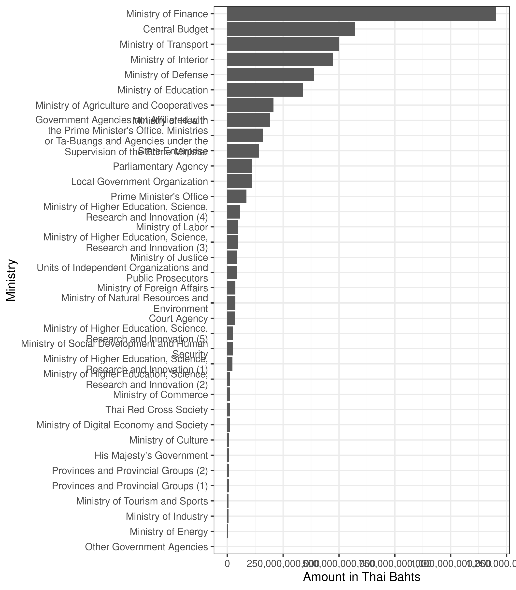
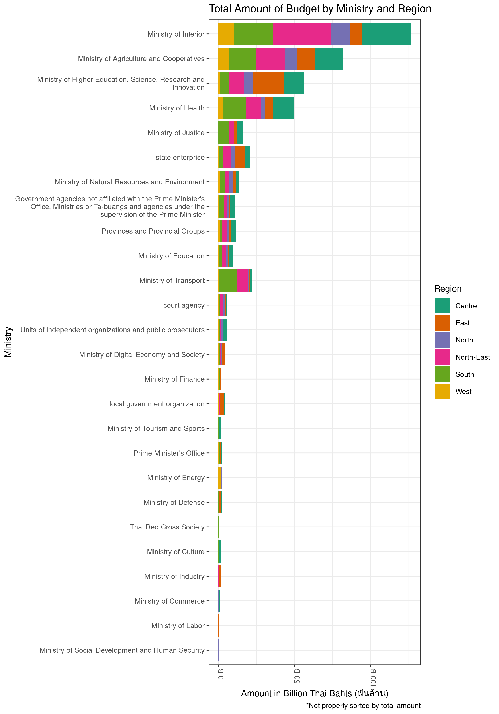
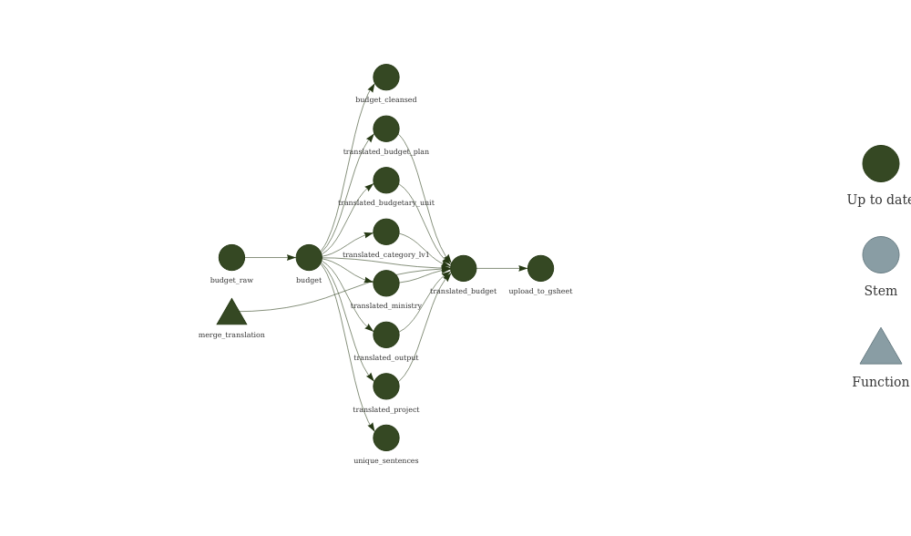

ThaiGov’s 2022 Budget+
================


This repository contains a richer version of [2022 Thai Government
Budget data](https://github.com/kaogeek/thailand-budget-pdf2csv).

> **Disclaimer: I do not guarantee that the derived fields are
> accurate.**

Improvements:

-   Translated most of the character columns from Thai to English using
    [Google Translation API](https://cloud.google.com/translate).
-   Added address fields extracted from `item_description`.

The data can be viewed and downloaded from here:

> <https://docs.google.com/spreadsheets/d/1rKR1kLuSDssT0_xLpGE_oRm2tPD5ZRhzErWq-8UzH6A/edit?usp=sharing>

So far I have only translated `ministry`, `budgetary_unit`,
`budget_plan`, `output`, `project`, `category_lv1`, `category_lv2`, and
`category_lv3` columns using my free Google monthly quota. If you are
interested to contribute, please submit a pull request with other
columns translated to English.

For the address fields, I have only extracted the low-hanging fruit ones
(e.g. words that start with “จังหวัด” “ตำบล” and “อำเภอ”). In the data,
they also used abbreviations to indicate addresses as well, which I will
include in the next release.

Feel free to use the R code below. :)

| budget\_plan                                  | budget\_plan\_en                               | budgetary\_unit  | budgetary\_unit\_en                 | category\_lv1 | category\_lv1\_en | category\_lv2            | category\_lv2\_en               | category\_lv3   | category\_lv3\_en | ministry                                             | ministry\_en                                                       | output | output\_en | project                                         | project\_en                                                | province | province\_en  | district      | district\_en   | subdistrict | region\_en |
|:----------------------------------------------|:-----------------------------------------------|:-----------------|:------------------------------------|:--------------|:------------------|:-------------------------|:--------------------------------|:----------------|:------------------|:-----------------------------------------------------|:-------------------------------------------------------------------|:-------|:-----------|:------------------------------------------------|:-----------------------------------------------------------|:---------|:--------------|:--------------|:---------------|:------------|:-----------|
| แผนงานยุทธศาสตร์เสริมสร้างให้คนมีสุขภาวะที่ดี | Strategic plans to promote people’s well-being | มหาวิทยาลัยมหิดล | Mahidol University                  | งบเงินอุดหนุน | subsidy budget    | เงินอุดหนุนทั่วไป        | general subsidy                 | ค่าครุภัณฑ์ ส่d | NA                | กระทรวงการอุดมศึกษา วิทยาศาสตร์ วิจัยและนวัตกรรม (4) | Ministry of Higher Education, Science, Research and Innovation (4) | NA     | NA         | โครงการเพิ่มศักยภาพการให้บริการทางด้านสาธารณสุข | Project to increase the capacity of public health services | นครปฐม   | Nakhon Pathom | อำเภอพุทธมณฑล | Phutthamonthon | ตำบลศาลายา  | Centre     |
| แผนงานยุทธศาสตร์เสริมสร้างพลังทางสังคม        | Social Empowerment Strategic Plan              | กรมปศุสัตว์      | Department of Livestock Development | งบดำเนินงาน   | operating budget  | ค่าตอบแทน ใช้สอยและวัสดุ | Compensation, use and materials | NA              | NA                | กระทรวงเกษตรและสหกรณ์                                | Ministry of Agriculture and Cooperatives                           | NA     | NA         | โครงการอันเนื่องมาจากพระราชดำริ                 | Royal projects                                             | NA       | NA            | NA            | NA             | NA          | NA         |

    #> `summarise()` has grouped output by 'ministry_en'. You can override using the `.groups` argument.

<!-- -->

<!-- -->

# Targets

``` r
options(tidyverse.quiet = TRUE)
tar_option_set(packages = c("dplyr", "ggplot2", "googlesheets4", "tidyr", "skimr", "magrittr", "googleLanguageR", "data.table"))
merge_translation <- function(x, translation, column) {
  translation %>%
    merge(x, ., by.x = column, by.y = "text", all.x = TRUE) %>%
    select(-detectedSourceLanguage) %>%
    rename_with( ~ gsub("translatedText", paste0(column, "_en"), .x, fixed = TRUE))
}
#> Established _targets.R and _targets_r/globals/unnamed-chunk-4.R.
```

``` r
tar_target(budget_raw, {
  read_sheet("https://docs.google.com/spreadsheets/d/1yyWXSTbq3CD_gNxks-krcSBzbszv3c_2Nq54lckoQ24/edit#gid=1625073248")
})
#> Defined target budget_raw automatically from chunk code.
#> Established _targets.R and _targets_r/targets/budget_raw.R.
```

``` r
list(
  tar_target(budget,
    budget_raw %>%
      janitor::clean_names()
  ),
  tar_target(unique_sentences, {
    budget %>%
      select(
        ministry,
        budgetary_unit,
        budget_plan,
        output,
        project,
        starts_with("category"),
        item_description
      ) %>% {
        as.character(unique(unlist(.)))
      }
  })
)
#> Established _targets.R and _targets_r/targets/data-prep.R.
```

``` r
list(
  tar_target(translated_ministry, {
    budget$ministry %>%
      unique() %>%
      gl_translate(target = "en")
  }),
  tar_target(translated_budgetary_unit, {
    budget$budgetary_unit %>%
      unique() %>%
      gl_translate(target = "en")
  }),
  tar_target(translated_budget_plan, {
    budget$budget_plan %>%
      unique() %>%
      gl_translate(target = "en")
  }),
  tar_target(translated_project, {
    budget$project %>%
      unique() %>%
      gl_translate(target = "en")
  }),
  tar_target(translated_output, {
    budget$output %>%
      unique() %>%
      gl_translate(target = "en")
  }),
  tar_target(translated_category_lv1, {
    budget$category_lv1 %>%
      unique() %>%
      gl_translate(target = "en")
  }),
  tar_target(translated_category_lv2, {
    budget$category_lv2 %>%
      unique() %>%
      gl_translate(target = "en")
  }),
  tar_target(translated_category_lv3, {
    budget$category_lv2 %>%
      unique() %>%
      gl_translate(target = "en")
  })
)
#> Established _targets.R and _targets_r/targets/translation.R.
```

``` r
tar_target(budget_plus, {
  budget %>%
    merge_translation(translated_ministry, "ministry") %>%
    merge_translation(translated_budgetary_unit, "budgetary_unit") %>%
    merge_translation(translated_budget_plan, "budget_plan") %>%
    merge_translation(translated_output, "output") %>%
    merge_translation(translated_project, "project") %>%
    merge_translation(translated_category_lv1, "category_lv1") %>%
    merge_translation(translated_category_lv2, "category_lv2") %>%
    merge_translation(translated_category_lv3, "category_lv3") %>% 
    dplyr::mutate(province = stringr::str_extract(item_description, "จังหวัด[^\\s]+|กรุงเทพมหานคร")) %>%
    dplyr::mutate(district = stringr::str_extract(item_description, "อำเภอ[^\\s]+|เขต[^\\s]+")) %>%
    dplyr::mutate(subdistrict = stringr::str_extract(item_description, "ตำบล[^\\s]+|แขวง[^\\s]+")) %>%
    # dplyr::mutate(province = stringr::str_extract_all(item_description, "จังหวัด[^\\s]+|กรุงเทพ[^\\s]+|จ\\.[^\\s]+")) %>%
    # dplyr::mutate(district = stringr::str_extract_all(item_description, "อำเภอ[^\\s]+|เขต[^\\s]+|อ\\.[^\\s]+")) %>%
    # dplyr::mutate(subdistrict = stringr::str_extract_all(item_description, "ตำบล[^\\s]+|แขวง[^\\s]+|ต\\.[^\\s]+")) %>%
    dplyr::mutate(province = gsub("จังหวัด", "", province)) %>%
    merge(dplyr::select(provinces, starts_with("district")), by = "district", all.x = TRUE) %>%
    merge(dplyr::select(distinct(provinces, province, .keep_all = T), starts_with("province"), region_en), by = "province", all.x = TRUE) %>%
    select(names(budget), everything())
})
#> Defined target budget_plus automatically from chunk code.
#> Established _targets.R and _targets_r/targets/budget_plus.R.
```

``` r
list(tar_target(provinces, {
  exclude_bkk <-
    rvest::read_html("https://en.wikipedia.org/wiki/List_of_districts_of_Thailand") %>%
    rvest::html_element(css = "table") %>%
    rvest::html_table() %>%
    janitor::clean_names() %>%
    setNames(c("district_en", "district", "province_en", "province", "region_en")) %>%
    dplyr::mutate(postcode = NA_integer_) %>%
    dplyr::mutate(district = paste0("อำเภอ", district))
  bkk <-
    rvest::read_html("https://en.wikipedia.org/wiki/List_of_districts_of_Bangkok") %>%
    rvest::html_element(css = "table") %>%
    rvest::html_table() %>%
    janitor::clean_names() %>%
    dplyr::mutate(province_en = "Bangkok", province = "กรุงเทพ", region_en = "Centre") %>%
    dplyr::select(district_en = district_khet, district = thai, province_en, province, region_en, postcode = post_code) %>%
    dplyr::mutate(district = paste0("เขต", district))
  rbind(bkk,exclude_bkk)
}))
#> Established _targets.R and _targets_r/targets/extract-addresses.R.
```

``` r
tar_target(upload_to_gsheet, {
  # googlesheets4::gs4_create("65_thailand_budget_extracted_b4_cleansing_with_ENlang",
  #            sheets = list(DATA = head(translated_budget, 10)))
  googlesheets4::sheet_write(
    data = budget_plus,
    ss = "https://docs.google.com/spreadsheets/d/1rKR1kLuSDssT0_xLpGE_oRm2tPD5ZRhzErWq-8UzH6A/edit?usp=sharing",
    sheet = "DATA"
  )
})
#> Defined target upload_to_gsheet automatically from chunk code.
#> Established _targets.R and _targets_r/targets/upload_to_gsheet.R.
```

# Pipeline

``` r
tar_make()
#> ✓ skip target provinces
#> ✓ skip target budget_raw
#> ✓ skip target budget
#> ✓ skip target translated_output
#> ✓ skip target translated_budget_plan
#> ✓ skip target translated_category_lv1
#> ✓ skip target translated_category_lv2
#> ✓ skip target translated_category_lv3
#> ✓ skip target translated_budgetary_unit
#> ✓ skip target translated_ministry
#> ✓ skip target translated_project
#> ✓ skip target unique_sentences
#> ✓ skip target budget_plus
#> ✓ skip target upload_to_gsheet
#> ✓ skip pipeline
```

``` r
tar_visnetwork()
```



# Data summary

``` r
library(targets)
library(skimr)
```

``` r
tar_read(budget_plus) %>%
  skimr::skim()
```

|                                                  |            |
|:-------------------------------------------------|:-----------|
| Name                                             | Piped data |
| Number of rows                                   | 51962      |
| Number of columns                                | 34         |
| \_\_\_\_\_\_\_\_\_\_\_\_\_\_\_\_\_\_\_\_\_\_\_   |            |
| Column type frequency:                           |            |
| character                                        | 27         |
| logical                                          | 4          |
| numeric                                          | 3          |
| \_\_\_\_\_\_\_\_\_\_\_\_\_\_\_\_\_\_\_\_\_\_\_\_ |            |
| Group variables                                  | None       |

Data summary

**Variable type: character**

| skim\_variable      | n\_missing | complete\_rate | min | max | empty | n\_unique | whitespace |
|:--------------------|-----------:|---------------:|----:|----:|------:|----------:|-----------:|
| item\_id            |          0 |           1.00 |  10 |  17 |     0 |     51767 |          0 |
| ref\_doc            |          0 |           1.00 |   8 |  12 |     0 |        24 |          0 |
| ministry            |          0 |           1.00 |   6 |  99 |     0 |        36 |          0 |
| budgetary\_unit     |          0 |           1.00 |   6 |  79 |     0 |       718 |          0 |
| budget\_plan        |          0 |           1.00 |  19 | 754 |     0 |        99 |          0 |
| output              |      27025 |           0.48 |  11 | 196 |     0 |       371 |          0 |
| project             |      27141 |           0.48 |  19 | 230 |     0 |      1351 |          0 |
| category\_lv1       |          3 |           1.00 |   2 |  72 |     0 |        31 |          0 |
| category\_lv2       |        123 |           1.00 |   7 | 354 |     0 |      1777 |          0 |
| category\_lv3       |      13659 |           0.74 |   7 | 348 |     0 |      1395 |          0 |
| category\_lv4       |      29930 |           0.42 |   8 | 118 |     0 |       217 |          0 |
| item\_description   |       5429 |           0.90 |   8 | 466 |     0 |     19806 |          0 |
| debug\_log          |      50918 |           0.02 | 167 | 847 |     0 |       767 |          0 |
| province            |      32807 |           0.37 |   1 |  39 |     0 |       149 |          0 |
| district            |      34301 |           0.34 |   4 |  56 |     0 |      1092 |          0 |
| ministry\_en        |          0 |           1.00 |  12 | 149 |     0 |        36 |          0 |
| budgetary\_unit\_en |          0 |           1.00 |   4 | 101 |     0 |       717 |          0 |
| budget\_plan\_en    |          0 |           1.00 |  25 | 848 |     0 |        89 |          0 |
| output\_en          |      27025 |           0.48 |   9 | 252 |     0 |       371 |          0 |
| project\_en         |      27141 |           0.48 |  14 | 298 |     0 |      1312 |          0 |
| category\_lv1\_en   |          0 |           1.00 |   2 |  90 |     0 |        26 |          0 |
| category\_lv2\_en   |        123 |           1.00 |   9 | 515 |     0 |      1751 |          0 |
| category\_lv3\_en   |      19921 |           0.62 |  13 |  80 |     0 |        16 |          0 |
| subdistrict         |      35776 |           0.31 |   6 |  32 |     0 |      2834 |          0 |
| district\_en        |      35576 |           0.32 |   2 |  26 |     0 |       838 |          0 |
| province\_en        |      35775 |           0.31 |   3 |  24 |     0 |        76 |          0 |
| region\_en          |      35775 |           0.31 |   4 |  10 |     0 |         6 |          0 |

**Variable type: logical**

| skim\_variable | n\_missing | complete\_rate | mean | count                  |
|:---------------|-----------:|---------------:|-----:|:-----------------------|
| cross\_func    |          0 |              1 | 0.15 | FAL: 44156, TRU: 7806  |
| category\_lv5  |      51962 |              0 |  NaN | :                      |
| category\_lv6  |      51962 |              0 |  NaN | :                      |
| obliged        |          0 |              1 | 0.32 | FAL: 35357, TRU: 16605 |

**Variable type: numeric**

| skim\_variable | n\_missing | complete\_rate |        mean |           sd |    p0 |     p25 |     p50 |      p75 |      p100 | hist  |
|:---------------|-----------:|---------------:|------------:|-------------:|------:|--------:|--------:|---------:|----------:|:------|
| ref\_page\_no  |          0 |              1 |      304.48 | 1.951600e+02 |     5 |     147 |     279 |      430 | 9.190e+02 | ▇▇▅▂▁ |
| fiscal\_year   |          0 |              1 |     2021.73 | 1.442000e+01 |  -287 |    2022 |    2022 |     2022 | 2.066e+03 | ▁▁▁▁▇ |
| amount         |         43 |              1 | 96753257.35 | 2.214143e+09 | -2551 | 1196100 | 5779100 | 21959700 | 3.106e+11 | ▇▁▁▁▁ |
