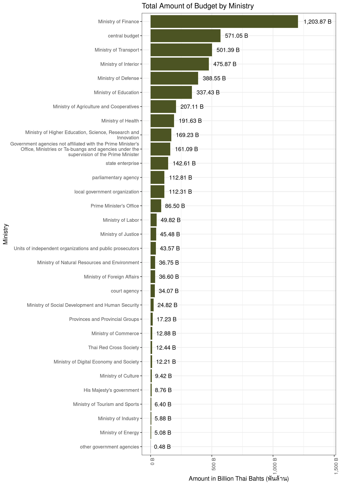

ThaiGov’s 2022 Budget
================


This repository contains R code that uses [Google Translation
API](https://cloud.google.com/translate) to translate [2022 Thai
Government Budget
data](https://github.com/kaogeek/thailand-budget-pdf2csv) from Thai to
English. A *partially* translated version of the data can be viewed and
downloaded from here:

> <https://docs.google.com/spreadsheets/d/1rKR1kLuSDssT0_xLpGE_oRm2tPD5ZRhzErWq-8UzH6A/edit?usp=sharing>

So far I have only translated `ministry`, `budgetary_unit`,
`budget_plan`, `output`, `project`, `category_lv1`, `category_lv2`, and
`category_lv3` columns using my free Google monthly quota. If you are
interested to contribute, please submit a pull request with other
columns translated to English. Feel free to use the R code below. :)

<div id="ekavifbwaw" style="overflow-x:auto;overflow-y:auto;width:auto;height:auto;">
<style>html {
  font-family: -apple-system, BlinkMacSystemFont, 'Segoe UI', Roboto, Oxygen, Ubuntu, Cantarell, 'Helvetica Neue', 'Fira Sans', 'Droid Sans', Arial, sans-serif;
}

#ekavifbwaw .gt_table {
  display: table;
  border-collapse: collapse;
  margin-left: auto;
  margin-right: auto;
  color: #333333;
  font-size: 16px;
  font-weight: normal;
  font-style: normal;
  background-color: #FFFFFF;
  width: auto;
  border-top-style: solid;
  border-top-width: 2px;
  border-top-color: #A8A8A8;
  border-right-style: none;
  border-right-width: 2px;
  border-right-color: #D3D3D3;
  border-bottom-style: solid;
  border-bottom-width: 2px;
  border-bottom-color: #A8A8A8;
  border-left-style: none;
  border-left-width: 2px;
  border-left-color: #D3D3D3;
}

#ekavifbwaw .gt_heading {
  background-color: #FFFFFF;
  text-align: center;
  border-bottom-color: #FFFFFF;
  border-left-style: none;
  border-left-width: 1px;
  border-left-color: #D3D3D3;
  border-right-style: none;
  border-right-width: 1px;
  border-right-color: #D3D3D3;
}

#ekavifbwaw .gt_title {
  color: #333333;
  font-size: 125%;
  font-weight: initial;
  padding-top: 4px;
  padding-bottom: 4px;
  border-bottom-color: #FFFFFF;
  border-bottom-width: 0;
}

#ekavifbwaw .gt_subtitle {
  color: #333333;
  font-size: 85%;
  font-weight: initial;
  padding-top: 0;
  padding-bottom: 4px;
  border-top-color: #FFFFFF;
  border-top-width: 0;
}

#ekavifbwaw .gt_bottom_border {
  border-bottom-style: solid;
  border-bottom-width: 2px;
  border-bottom-color: #D3D3D3;
}

#ekavifbwaw .gt_col_headings {
  border-top-style: solid;
  border-top-width: 2px;
  border-top-color: #D3D3D3;
  border-bottom-style: solid;
  border-bottom-width: 2px;
  border-bottom-color: #D3D3D3;
  border-left-style: none;
  border-left-width: 1px;
  border-left-color: #D3D3D3;
  border-right-style: none;
  border-right-width: 1px;
  border-right-color: #D3D3D3;
}

#ekavifbwaw .gt_col_heading {
  color: #333333;
  background-color: #FFFFFF;
  font-size: 100%;
  font-weight: normal;
  text-transform: inherit;
  border-left-style: none;
  border-left-width: 1px;
  border-left-color: #D3D3D3;
  border-right-style: none;
  border-right-width: 1px;
  border-right-color: #D3D3D3;
  vertical-align: bottom;
  padding-top: 5px;
  padding-bottom: 6px;
  padding-left: 5px;
  padding-right: 5px;
  overflow-x: hidden;
}

#ekavifbwaw .gt_column_spanner_outer {
  color: #333333;
  background-color: #FFFFFF;
  font-size: 100%;
  font-weight: normal;
  text-transform: inherit;
  padding-top: 0;
  padding-bottom: 0;
  padding-left: 4px;
  padding-right: 4px;
}

#ekavifbwaw .gt_column_spanner_outer:first-child {
  padding-left: 0;
}

#ekavifbwaw .gt_column_spanner_outer:last-child {
  padding-right: 0;
}

#ekavifbwaw .gt_column_spanner {
  border-bottom-style: solid;
  border-bottom-width: 2px;
  border-bottom-color: #D3D3D3;
  vertical-align: bottom;
  padding-top: 5px;
  padding-bottom: 6px;
  overflow-x: hidden;
  display: inline-block;
  width: 100%;
}

#ekavifbwaw .gt_group_heading {
  padding: 8px;
  color: #333333;
  background-color: #FFFFFF;
  font-size: 100%;
  font-weight: initial;
  text-transform: inherit;
  border-top-style: solid;
  border-top-width: 2px;
  border-top-color: #D3D3D3;
  border-bottom-style: solid;
  border-bottom-width: 2px;
  border-bottom-color: #D3D3D3;
  border-left-style: none;
  border-left-width: 1px;
  border-left-color: #D3D3D3;
  border-right-style: none;
  border-right-width: 1px;
  border-right-color: #D3D3D3;
  vertical-align: middle;
}

#ekavifbwaw .gt_empty_group_heading {
  padding: 0.5px;
  color: #333333;
  background-color: #FFFFFF;
  font-size: 100%;
  font-weight: initial;
  border-top-style: solid;
  border-top-width: 2px;
  border-top-color: #D3D3D3;
  border-bottom-style: solid;
  border-bottom-width: 2px;
  border-bottom-color: #D3D3D3;
  vertical-align: middle;
}

#ekavifbwaw .gt_from_md > :first-child {
  margin-top: 0;
}

#ekavifbwaw .gt_from_md > :last-child {
  margin-bottom: 0;
}

#ekavifbwaw .gt_row {
  padding-top: 8px;
  padding-bottom: 8px;
  padding-left: 5px;
  padding-right: 5px;
  margin: 10px;
  border-top-style: solid;
  border-top-width: 1px;
  border-top-color: #D3D3D3;
  border-left-style: none;
  border-left-width: 1px;
  border-left-color: #D3D3D3;
  border-right-style: none;
  border-right-width: 1px;
  border-right-color: #D3D3D3;
  vertical-align: middle;
  overflow-x: hidden;
}

#ekavifbwaw .gt_stub {
  color: #333333;
  background-color: #FFFFFF;
  font-size: 100%;
  font-weight: initial;
  text-transform: inherit;
  border-right-style: solid;
  border-right-width: 2px;
  border-right-color: #D3D3D3;
  padding-left: 12px;
}

#ekavifbwaw .gt_summary_row {
  color: #333333;
  background-color: #FFFFFF;
  text-transform: inherit;
  padding-top: 8px;
  padding-bottom: 8px;
  padding-left: 5px;
  padding-right: 5px;
}

#ekavifbwaw .gt_first_summary_row {
  padding-top: 8px;
  padding-bottom: 8px;
  padding-left: 5px;
  padding-right: 5px;
  border-top-style: solid;
  border-top-width: 2px;
  border-top-color: #D3D3D3;
}

#ekavifbwaw .gt_grand_summary_row {
  color: #333333;
  background-color: #FFFFFF;
  text-transform: inherit;
  padding-top: 8px;
  padding-bottom: 8px;
  padding-left: 5px;
  padding-right: 5px;
}

#ekavifbwaw .gt_first_grand_summary_row {
  padding-top: 8px;
  padding-bottom: 8px;
  padding-left: 5px;
  padding-right: 5px;
  border-top-style: double;
  border-top-width: 6px;
  border-top-color: #D3D3D3;
}

#ekavifbwaw .gt_striped {
  background-color: rgba(128, 128, 128, 0.05);
}

#ekavifbwaw .gt_table_body {
  border-top-style: solid;
  border-top-width: 2px;
  border-top-color: #D3D3D3;
  border-bottom-style: solid;
  border-bottom-width: 2px;
  border-bottom-color: #D3D3D3;
}

#ekavifbwaw .gt_footnotes {
  color: #333333;
  background-color: #FFFFFF;
  border-bottom-style: none;
  border-bottom-width: 2px;
  border-bottom-color: #D3D3D3;
  border-left-style: none;
  border-left-width: 2px;
  border-left-color: #D3D3D3;
  border-right-style: none;
  border-right-width: 2px;
  border-right-color: #D3D3D3;
}

#ekavifbwaw .gt_footnote {
  margin: 0px;
  font-size: 90%;
  padding: 4px;
}

#ekavifbwaw .gt_sourcenotes {
  color: #333333;
  background-color: #FFFFFF;
  border-bottom-style: none;
  border-bottom-width: 2px;
  border-bottom-color: #D3D3D3;
  border-left-style: none;
  border-left-width: 2px;
  border-left-color: #D3D3D3;
  border-right-style: none;
  border-right-width: 2px;
  border-right-color: #D3D3D3;
}

#ekavifbwaw .gt_sourcenote {
  font-size: 90%;
  padding: 4px;
}

#ekavifbwaw .gt_left {
  text-align: left;
}

#ekavifbwaw .gt_center {
  text-align: center;
}

#ekavifbwaw .gt_right {
  text-align: right;
  font-variant-numeric: tabular-nums;
}

#ekavifbwaw .gt_font_normal {
  font-weight: normal;
}

#ekavifbwaw .gt_font_bold {
  font-weight: bold;
}

#ekavifbwaw .gt_font_italic {
  font-style: italic;
}

#ekavifbwaw .gt_super {
  font-size: 65%;
}

#ekavifbwaw .gt_footnote_marks {
  font-style: italic;
  font-weight: normal;
  font-size: 65%;
}
</style>
<table class="gt_table">
  
  <thead class="gt_col_headings">
    <tr>
      <th class="gt_col_heading gt_columns_bottom_border gt_left" rowspan="1" colspan="1">budget_plan</th>
      <th class="gt_col_heading gt_columns_bottom_border gt_left" rowspan="1" colspan="1">budget_plan_en</th>
      <th class="gt_col_heading gt_columns_bottom_border gt_left" rowspan="1" colspan="1">budgetary_unit</th>
      <th class="gt_col_heading gt_columns_bottom_border gt_left" rowspan="1" colspan="1">budgetary_unit_en</th>
      <th class="gt_col_heading gt_columns_bottom_border gt_left" rowspan="1" colspan="1">category_lv1</th>
      <th class="gt_col_heading gt_columns_bottom_border gt_left" rowspan="1" colspan="1">category_lv1_en</th>
      <th class="gt_col_heading gt_columns_bottom_border gt_left" rowspan="1" colspan="1">category_lv2</th>
      <th class="gt_col_heading gt_columns_bottom_border gt_left" rowspan="1" colspan="1">category_lv2_en</th>
      <th class="gt_col_heading gt_columns_bottom_border gt_left" rowspan="1" colspan="1">category_lv3</th>
      <th class="gt_col_heading gt_columns_bottom_border gt_left" rowspan="1" colspan="1">category_lv3_en</th>
      <th class="gt_col_heading gt_columns_bottom_border gt_left" rowspan="1" colspan="1">ministry</th>
      <th class="gt_col_heading gt_columns_bottom_border gt_left" rowspan="1" colspan="1">ministry_en</th>
      <th class="gt_col_heading gt_columns_bottom_border gt_left" rowspan="1" colspan="1">output</th>
      <th class="gt_col_heading gt_columns_bottom_border gt_left" rowspan="1" colspan="1">output_en</th>
      <th class="gt_col_heading gt_columns_bottom_border gt_left" rowspan="1" colspan="1">project</th>
      <th class="gt_col_heading gt_columns_bottom_border gt_left" rowspan="1" colspan="1">project_en</th>
    </tr>
  </thead>
  <tbody class="gt_table_body">
    <tr><td class="gt_row gt_left">แผนงานยุทธศาสตร์จัดการผลกระทบจากการเปลี่ยนแปลงสภาวะภูมิอากาศ</td>
<td class="gt_row gt_left">Climate Change Impact Strategic Work Plan</td>
<td class="gt_row gt_left">สำนักงานปลัดกระทรวงดิจิทัลเพื่อเศรษฐกิจและสังคม</td>
<td class="gt_row gt_left">Office of the Permanent Secretary, Ministry of Digital Economy and Society</td>
<td class="gt_row gt_left">งบลงทุน</td>
<td class="gt_row gt_left">investment budget</td>
<td class="gt_row gt_left">ค่าครุภัณฑ์ ที่ดินและสิ่งก่อสร้าง</td>
<td class="gt_row gt_left">Cost of equipment, land and construction</td>
<td class="gt_row gt_left">ค่าครุภัณฑ์</td>
<td class="gt_row gt_left">cost of equipment</td>
<td class="gt_row gt_left">กระทรวงดิจิทัลเพื่อเศรษฐกิจและสังคม</td>
<td class="gt_row gt_left">Ministry of Digital Economy and Society</td>
<td class="gt_row gt_left">NA</td>
<td class="gt_row gt_left">NA</td>
<td class="gt_row gt_left">โครงการจัดหาเครื่องวัดลมเฉือน (Lidar) และเครื่องมือ ตรวจลมชั้นบน</td>
<td class="gt_row gt_left">Project for procurement of wind shear gauges (lidar) and instruments for wind monitoring upstairs</td></tr>
    <tr><td class="gt_row gt_left">แผนงานบูรณาการสร้างรายได้จากการท่องเที่ยว</td>
<td class="gt_row gt_left">Integrated program to generate income from tourism</td>
<td class="gt_row gt_left">กรมโยธาธิการและผังเมือง</td>
<td class="gt_row gt_left">Department of Public Works and Town &amp; Country Planning</td>
<td class="gt_row gt_left">งบลงทุน</td>
<td class="gt_row gt_left">investment budget</td>
<td class="gt_row gt_left">ค่าครุภัณฑ์ ที่ดินและสิ่งก่อสร้าง</td>
<td class="gt_row gt_left">Cost of equipment, land and construction</td>
<td class="gt_row gt_left">ค่าที่ดินและสิ่งก่อสร้าง</td>
<td class="gt_row gt_left">cost of land and construction</td>
<td class="gt_row gt_left">กระทรวงมหาดไทย</td>
<td class="gt_row gt_left">Ministry of Interior</td>
<td class="gt_row gt_left">NA</td>
<td class="gt_row gt_left">NA</td>
<td class="gt_row gt_left">โครงการพัฒนาปัจจัยพื้นฐานด้านการท่องเที่ยว</td>
<td class="gt_row gt_left">Tourism Fundamentals Development Project</td></tr>
  </tbody>
  
  
</table>
</div>

<!-- -->

# Targets

``` r
options(tidyverse.quiet = TRUE)
tar_option_set(packages = c("dplyr", "ggplot2", "googlesheets4", "tidyr", "skimr", "magrittr", "googleLanguageR", "data.table"))
merge_translation <- function(x, translation, column) {
  translation %>%
    merge(x, ., by.x = column, by.y = "text") %>%
    select(-detectedSourceLanguage) %>%
    rename_with( ~ gsub("translatedText", paste0(column, "_en"), .x, fixed = TRUE))
}
#> Established _targets.R and _targets_r/globals/unnamed-chunk-4.R.
```

``` r
tar_target(budget_raw, {
  read_sheet("https://docs.google.com/spreadsheets/d/1yyWXSTbq3CD_gNxks-krcSBzbszv3c_2Nq54lckoQ24/edit#gid=1625073248")
})
#> Defined target budget_raw automatically from chunk code.
#> Established _targets.R and _targets_r/targets/budget_raw.R.
```

``` r
list(
  tar_target(budget,
    budget_raw %>%
      janitor::clean_names()
  ),
  tar_target(unique_sentences, {
    budget %>%
      select(
        ministry,
        budgetary_unit,
        budget_plan,
        output,
        project,
        starts_with("category"),
        item_description
      ) %>% {
        as.character(unique(unlist(.)))
      }
  })
)
#> Established _targets.R and _targets_r/targets/data-prep.R.
```

``` r
list(
  tar_target(translated_ministry, {
    budget$ministry %>%
      unique() %>%
      gl_translate(target = "en")
  }),
  tar_target(translated_budgetary_unit, {
    budget$budgetary_unit %>%
      unique() %>%
      gl_translate(target = "en")
  }),
  tar_target(translated_budget_plan, {
    budget$budget_plan %>%
      unique() %>%
      gl_translate(target = "en")
  }),
  tar_target(translated_project, {
    budget$project %>%
      unique() %>%
      gl_translate(target = "en")
  }),
  tar_target(translated_output, {
    budget$output %>%
      unique() %>%
      gl_translate(target = "en")
  }),
  tar_target(translated_category_lv1, {
    budget$category_lv1 %>%
      unique() %>%
      gl_translate(target = "en")
  }),
  tar_target(translated_category_lv2, {
    budget$category_lv2 %>%
      unique() %>%
      gl_translate(target = "en")
  }),
  tar_target(translated_category_lv3, {
    budget$category_lv2 %>%
      unique() %>%
      gl_translate(target = "en")
  })
)
#> Established _targets.R and _targets_r/targets/translation.R.
```

``` r
tar_target(translated_budget, {
  budget %>%
    merge_translation(translated_ministry, "ministry") %>%
    merge_translation(translated_budgetary_unit, "budgetary_unit") %>%
    merge_translation(translated_budget_plan, "budget_plan") %>%
    merge_translation(translated_output, "output") %>%
    merge_translation(translated_project, "project") %>%
    merge_translation(translated_category_lv1, "category_lv1") %>%
    merge_translation(translated_category_lv2, "category_lv2") %>%
    merge_translation(translated_category_lv3, "category_lv3") %>%
    select(names(budget), everything())
})
#> Defined target translated_budget automatically from chunk code.
#> Established _targets.R and _targets_r/targets/translated_budget.R.
```

``` r
tar_target(upload_to_gsheet, {
  # googlesheets4::gs4_create("65_thailand_budget_extracted_b4_cleansing_with_ENlang",
  #            sheets = list(DATA = head(translated_budget, 10)))
  googlesheets4::sheet_write(
    data = translated_budget,
    ss = "https://docs.google.com/spreadsheets/d/1rKR1kLuSDssT0_xLpGE_oRm2tPD5ZRhzErWq-8UzH6A/edit?usp=sharing",
    sheet = "DATA"
  )
})
#> Defined target upload_to_gsheet automatically from chunk code.
#> Established _targets.R and _targets_r/targets/upload_to_gsheet.R.
```

# Pipeline

``` r
tar_make()
#> ✓ skip target budget_raw
#> ✓ skip target budget
#> ✓ skip target translated_output
#> ✓ skip target translated_budget_plan
#> ✓ skip target translated_category_lv1
#> ✓ skip target translated_category_lv2
#> ✓ skip target translated_category_lv3
#> ✓ skip target unique_sentences
#> ✓ skip target translated_ministry
#> ✓ skip target translated_budgetary_unit
#> ✓ skip target translated_project
#> ✓ skip target translated_budget
#> ✓ skip target upload_to_gsheet
#> ✓ skip pipeline
```

``` r
tar_visnetwork()
```


# Example Output

``` r
library(targets)
library(skimr)
```

``` r
tar_read(budget) %>%
  skimr::skim()
```

|                                                  |            |
|:-------------------------------------------------|:-----------|
| Name                                             | Piped data |
| Number of rows                                   | 51767      |
| Number of columns                                | 20         |
| \_\_\_\_\_\_\_\_\_\_\_\_\_\_\_\_\_\_\_\_\_\_\_   |            |
| Column type frequency:                           |            |
| character                                        | 13         |
| logical                                          | 4          |
| numeric                                          | 3          |
| \_\_\_\_\_\_\_\_\_\_\_\_\_\_\_\_\_\_\_\_\_\_\_\_ |            |
| Group variables                                  | None       |

Data summary

**Variable type: character**

| skim\_variable    | n\_missing | complete\_rate | min | max | empty | n\_unique | whitespace |
|:------------------|-----------:|---------------:|----:|----:|------:|----------:|-----------:|
| item\_id          |          0 |           1.00 |  10 |  17 |     0 |     51767 |          0 |
| ref\_doc          |          0 |           1.00 |   8 |  12 |     0 |        24 |          0 |
| ministry          |          0 |           1.00 |   6 |  99 |     0 |        36 |          0 |
| budgetary\_unit   |          0 |           1.00 |   6 |  79 |     0 |       718 |          0 |
| budget\_plan      |          0 |           1.00 |  19 | 754 |     0 |        99 |          0 |
| output            |      26898 |           0.48 |  11 | 196 |     0 |       371 |          0 |
| project           |      27073 |           0.48 |  19 | 230 |     0 |      1351 |          0 |
| category\_lv1     |          3 |           1.00 |   2 |  72 |     0 |        31 |          0 |
| category\_lv2     |        122 |           1.00 |   7 | 354 |     0 |      1777 |          0 |
| category\_lv3     |      13654 |           0.74 |   7 | 348 |     0 |      1395 |          0 |
| category\_lv4     |      29904 |           0.42 |   8 | 118 |     0 |       217 |          0 |
| item\_description |       5429 |           0.90 |   8 | 466 |     0 |     19806 |          0 |
| debug\_log        |      50733 |           0.02 | 167 | 847 |     0 |       767 |          0 |

**Variable type: logical**

| skim\_variable | n\_missing | complete\_rate | mean | count                  |
|:---------------|-----------:|---------------:|-----:|:-----------------------|
| cross\_func    |          0 |              1 | 0.15 | FAL: 43971, TRU: 7796  |
| category\_lv5  |      51767 |              0 |  NaN | :                      |
| category\_lv6  |      51767 |              0 |  NaN | :                      |
| obliged        |          0 |              1 | 0.32 | FAL: 35279, TRU: 16488 |

**Variable type: numeric**

| skim\_variable | n\_missing | complete\_rate |        mean |           sd |    p0 |     p25 |     p50 |      p75 |      p100 | hist  |
|:---------------|-----------:|---------------:|------------:|-------------:|------:|--------:|--------:|---------:|----------:|:------|
| ref\_page\_no  |          0 |              1 |      304.33 | 1.951500e+02 |     5 |     147 |     279 |      429 | 9.190e+02 | ▇▇▅▂▁ |
| fiscal\_year   |          0 |              1 |     2021.73 | 1.445000e+01 |  -287 |    2022 |    2022 |     2022 | 2.066e+03 | ▁▁▁▁▇ |
| amount         |         43 |              1 | 97021729.28 | 2.218307e+09 | -2551 | 1188000 | 5736000 | 21816175 | 3.106e+11 | ▇▁▁▁▁ |
